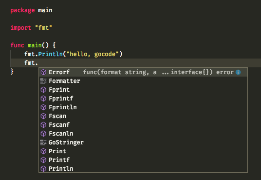

# Editors and plugins

Go has a very rich ecosystem and it is supported directly or via plugins on many editors.
You can find a list of them on the [Go wiki](https://github.com/golang/go/wiki/IDEsAndTextEditorPlugins).

I have personally used:

- [Atom](https://atom.io/) with [go-plus](https://github.com/joefitzgerald/go-plus)
- [vim](http://www.vim.org/) with [vim-go](https://github.com/fatih/vim-go)
- [Visual Studio Code](https://code.visualstudio.com/) with [vscode-go](https://github.com/Microsoft/vscode-go)

For this workshop we will use Visual Studio Code (aka VSCode), so please install it now if you haven't yet
and install the corresponding Go plugin. You can find instructions on how to do so [here](https://github.com/Microsoft/vscode-go#using).

Once you install the Go plugin on VSCode it will install a bunch of tools, do not worry too much about them yet.
By the end of this chapter you'll know what they all do and how they can help you write better code.

## Go's philosophy for source code tools

Rather than having each editor reimplement the basic tools that all gophers use with their code,
the Go community has produced small tools for each specific use case that are very simple to call
from any editor.

This means that no matter what editor you use, you might be calling the same code to navigate from
a function to its definition.

Those tools are mainly divided into three categories of tools:

- those that modify your code, adding formatting or even modifying your code statements,
- those that analyze your code and show warnings, and
- those that help you navigating an existing code base.

## Code completion

Code completion allows you to write code faster and avoid spelling mistakes. Many gophers love it,
and it is provided for most editors with [gocode](https://github.com/nsf/gocode).

You do not need to install it, as `vscode-go` will install it for you. Calling it directly is rare,
instead your editor will call it.

### Exercise: code completion

Open [hello.go](hello.go) with VSCode, you should see this content:

[embedmd]:# (hello.go /package main/ $)
```go
package main

import "fmt"

func main() {
	fmt.Println("hello, gocode")
}
```

Move your cursor below the `fmt.Println` line and type `fmt.`, you should see a list of all the identifiers
defined in the `fmt` package.



## Congratulations

You have a now an editor running with a working Go plugin. Let's explore how all the tools that we just installed
will make writing code much easier in the [next section](2-gofmt-and-friends.md).
