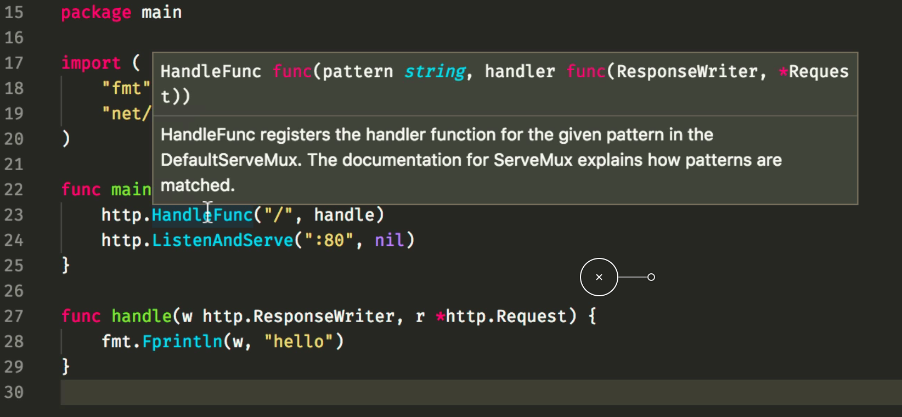

# Tools for reading code

We spend more time reading code than writing it, and as such, tooling
that helps us reading code is an important addition to the tool box
of any good gopher.

The tools we will see during this chapter perform static analysis in
code (as the ones we saw in the previous chapter on edition tools).
We will see tools that allow us to better understand the behavior of
a program based on its dynamic behavior
[later in this workshop](../../3-dynamic-analysis/README.md).

## `go doc` and `godoc`

These two tools are very related, but they're different. Let's see first
on what they are similar.

Both tools extract information from existing code for all the exported
identifiers in a package, attaching the comments related to those identifiers
to create an autogenerated package documentation.

This sounds quite similar to javadoc and other similar tools, but Go
documentation does not have any extra formatting rules. Everything is plain
text.

For instance, we can get information about `json.Encoder` by running:

```bash
$ go doc json.Encoder
package json // import "encoding/json"

type Encoder struct {
        // Has unexported fields.
}
    An Encoder writes JSON values to an output stream.


func NewEncoder(w io.Writer) *Encoder
func (enc *Encoder) Encode(v interface{}) error
func (enc *Encoder) SetEscapeHTML(on bool)
func (enc *Encoder) SetIndent(prefix, indent string)
```

But what if we ran `go doc template.New`? Would that give the docs for `text/template`
or `html/template`? When that difference matters you can use a different invocation style:

```bash
$ go doc text/template New
func New(name string) *Template
    New allocates a new, undefined template with the given name.
```

This tool works with any package in your `GOPATH`, so you can run:

```bash
$ go doc logrus.Info
package logrus // import "github.com/Sirupsen/logrus"

func Info(args ...interface{})
    Info logs a message at level Info on the standard logger.
```

### Integration of `go doc` and VSCode

This tool is the same one VSCode uses to display the documentation when hovering over an
identifier:



## So what's `godoc` for?

If `go doc` is able to give us information about any identifier in our
`GOPATH`, what's `godoc` for?

It is able to provide full documentation for packages in text form:

```bash
$ godoc errors
use 'godoc cmd/errors' for documentation on the errors command

PACKAGE DOCUMENTATION

package errors
    import "errors"

    Package errors implements functions to manipulate errors.

FUNCTIONS

func New(text string) error
    New returns an error that formats as the given text.
```

But the main reason to use `godoc` is the fact that it is a full
fledged web server! Simply add the `-http` flag with the address
you want to listen on.

```bash
$ godoc -http :6060
```

Once this is running you can now visit http://localhost:6060 and see
a web page with the documentation for the Go project.
Even more interesting you can visit http://localhost:6060/pkg and see
the list of *all* of your packages and their generated docs!

This is very useful to understand what the documentation for your
package looks like.

A great usage of this binary is [godoc.org](https://godoc.org), which
allows you to see the documentation to any package hosted publicly
and also has a search feature with ranking by GitHub stars and how
many packages import every repository.

Go check it out and try to find some useful packages to your work!

## Congraulations

You now know not only how to use `godoc` and `go doc` but also the
differences between those two. You can go around and ask other gophers
what's the difference, I'm sure some will *panic*.

Let's continue with a more advanced tools that allow us to navigate
code in the [next chapter](2-guru.md).