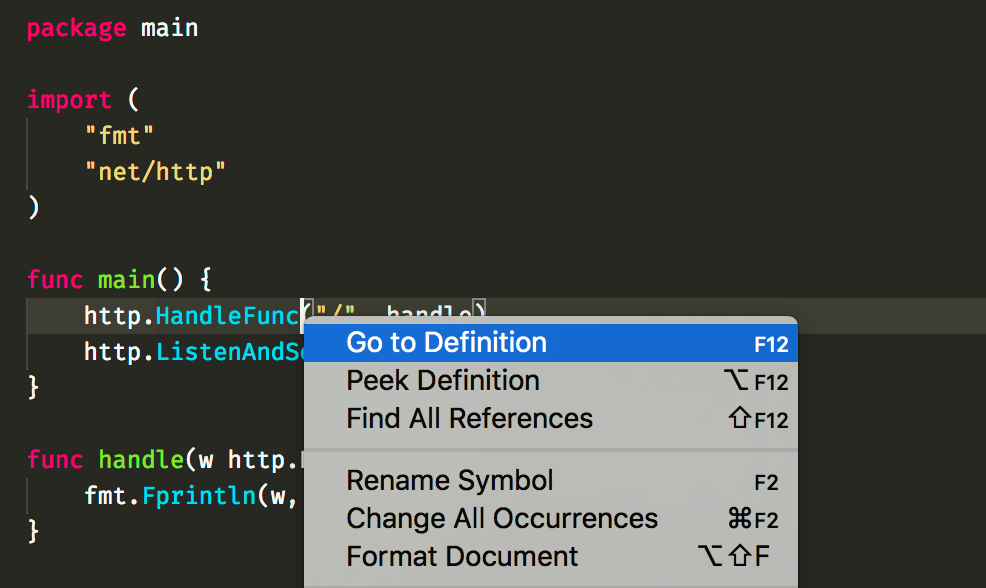
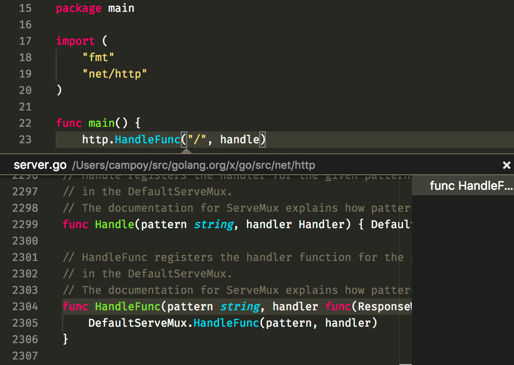

# Tools for navigating code

Source code in any language is a very rich structure with many links
forward and backwards, every variable usage, every function call,
refers to some object defined somewhere in the code base.

Navigating this with the help of just `grep` or any other text search
is far from optimal, but some tools exist specifically for this.

## godef

`godef` allows you to navigate those links in a specific direction,
given a usage of a variable, function, or any other identifier, it
is able to tell use where that symbol was declared in the code base.

You can run it directly from the command line:

```bash
$ godef -f main.go http.HandleFunc
/Users/campoy/src/golang.org/x/go/src/net/http/server.go:2304:6
```

The output is the file, line, and column where `http.HandleFunc` was
declared.

Although you can use `godef` directly, most of the time you'll use
it directly from your editor by clicking on `Go to Definition`.



It's also useful to use `Peek Definition` to see the code without
leaving the current context.



## guru

TODO: integration with VSCode?

## srcgraph

TODO: extension and github navigation

## Congratulations

You now know how to manage your workspace, write code that has no
bugs (or at least not too many), and analyze and navigate any code
base that you might find.

What's the next step? Well, we should start compiling that code!
Let's do that now, with the [next section](../2-building-artifacts/README.md).