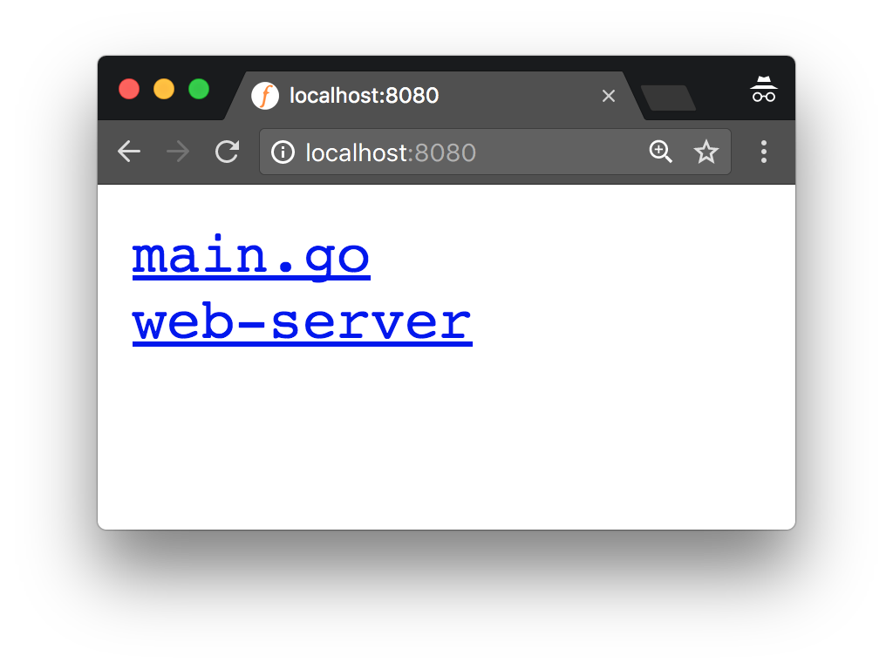

# Go compilation basics

We already saw a way to generate binaries from your code on the first chapter of the
whole workshop: `go get`. There's another command that also installs some package
and stores the resulting binary into `$GOPATH/bin`: that's `go install`.

For this section we will use a different one that gives us more control on what and how
exactly we compile: `go build`.

Let's start by opening a terminal window in the directory named
[web-server](web-server) under `2-building-artifcats/1-standalone-binares` and run:

```bash
$ go build
```

This will generate an executable binary with the name of the directory (`web-server`)
and with an `.exe` extension if you are in a Windows environment.

You should be able to run it:

```bash
$ ./web-server
```

Visit http://localhost:8080 and you should be able to see a web server showing
the contents of the current directory.



You can send this directory to anyone else running the same platform as you, not matter
if they know anything about Go or not, and they should be able to simply run the binary.
No need to install extra dependencies or libraries!

## Cross-compilation

But what if your friend uses a different platform, let's say Windows?
Easy! Simply cross-compile to any platform by setting the `GOOS` and `GOARCH` variables.

```bash
$ GOOS=windows go build
$ file web-server.exe
web-server.exe: PE32+ executable (console) x86-64 (stripped to external PDB), for MS Windows
```

That's it!

## Conditional compilation

Sometimes you might need to write code that is only compiled for some specific platform.
To do so you have two complementary mechanisms at hand:

- file suffixes, and
- build constraints.

### Conditional compilation with file suffixes

If you want a Go file that is only compiled for platforms where `GOOS` is `windows`,
you can simply add a `_windows` suffix to the file name!

So `foo_windows.go` will be compiled only when compiling for Windows, while `foo_linux.go`
will be used only for Linux and so on.

In the same way, you can also use an architecture
identifier as a suffix to constraint the compilation to only those platforms with the
given `GOARCH`: `foo_amd64.go` will be compiled on my laptop (it's an `amd64`), but
`foo_arm.go` will be ignored.

You can also constraint the compilation to a specific combination of `$GOOS` and `$GOARCH`
by using the suffix `_GOOS_GOARCH.go`, such as `foo_darwin_amd64.go`.

### Conditional compilation with build constraints

Build constraints are more expressive than the file suffixes presented above.
Rather than limiting the compilation to a single OS or arhictecture, here we can use
a large range of conditions.

They appear as comments at the beginning of a `.go` file with the syntax:

```go
// +build linux
```

The code in this file will be compiled *only* if `GOOS` is set to `linux`. You can see
the current value of your `GOOS` by running:

```bash
$ go env GOOS
darwin
```

In addition to the build tags related to `GOOS` and `GOARCH`, we can also use the version
of the Go compiler itself. For instance, we can ask for a file to be compiled only if
the compiler is before Go 1.8 or later by adding:

```go
// +build go1.8
```

Or if we wanted to compile something if it has a version earlier than `go1.7` we could use:

```go
// +build !go1.8
```

Finally, we can add any custom tags we might want to use, and defined them via build flags
we can pass to `go build` with the `-tags` flag.

You can see an example on how to enable/disable logging with zero cost at runtime by
the great Dave Chenney on [this blog post](https://dave.cheney.net/2014/09/28/using-build-to-switch-between-debug-and-release).

And since we're at it, let's talk about build flags.

## Build flags

You can find a full list of all the possible flags you can pass to `go build`
[here](https://golang.org/cmd/go/#hdr-Compile_packages_and_dependencies), but we will
cover the most important ones here too.

List all the compiled packages with `v`

```bash
$ go build -v github.com/golang/example/hello
github.com/golang/example/hello
```

All the dependencies were up to date, so only `hello` was recompiled. You can force
recompiling all dependencies with `-a`:

```bash
$ go build -v -a github.com/golang/example/hello
internal/race
sync/atomic
internal/cpu
unicode/utf8
github.com/golang/example/stringutil
sync
math
io
syscall
time
strconv
internal/poll
reflect
os
fmt
github.com/golang/example/hello
```

One of my favorite flags is `-race` which enables the data race detector. We'll discuss
what this implies when we talk about `testing`, but for now you can think about it as a
mode where the program will detect mistakes much easier ... but it will also run way
slower.

If you want to call C programs from Go you will probably need to pass `-LDFLAGS` and `-GCCFLAGS` to `gcc`. To do so from the `go` tool we use `ldflags` and `gccflags`.
`cgo` is out of the scope for this workshop, but you can learn more about it with this
[justforfunc video](https://www.youtube.com/watch?v=yuW6BwOS8Eg).

### Exercise: build tags and constraints

Write a program that will print `running RELEASE version` when compiled with `go build -tags release` or `running DEV version` otherwise.

To do so you will need to use three different files, one of them is `main.go`, with the
following contents:

```go
package main

import "fmt"

func main() {
	fmt.Println("running %s version", version)
}
```

It is up to you to define a constant named `version` whose value changes according to
the given build tags by adding the missing files in the [exercise](exercise) directory
under `$GOPATH/src/github.com/campoy/go-tooling-workshop/2-building-artifacts/exercise`.

## Congratulations

You're now an expert on ... basic compilation of Go programs. But you're already able
to cross-compile Go programs to other platforms!

In the [next chapter](./2-docker.md), let's learn how to build binaries for `Docker`.

TODO: Should I talk about go-bindata? or just move to Docker? maybe to dynamic analysis?
